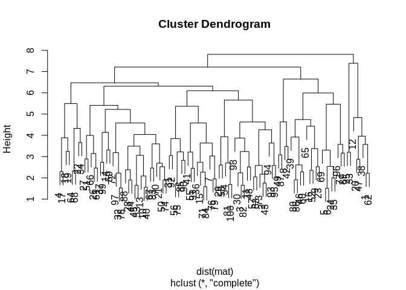
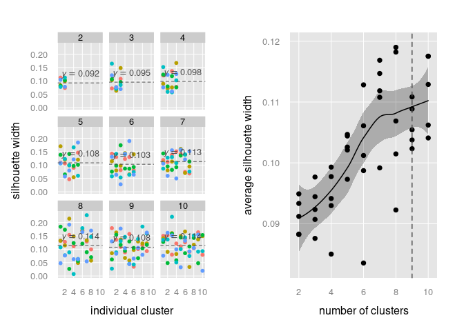
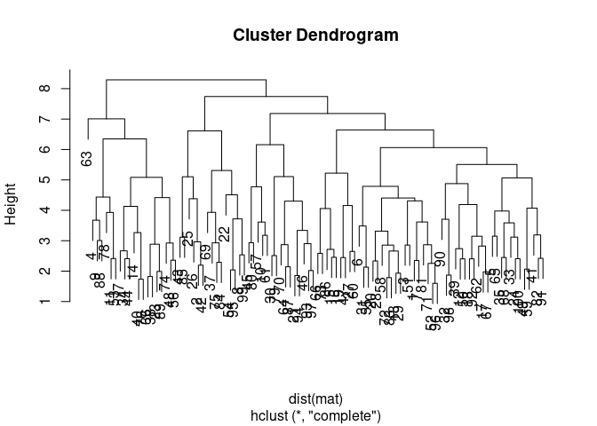
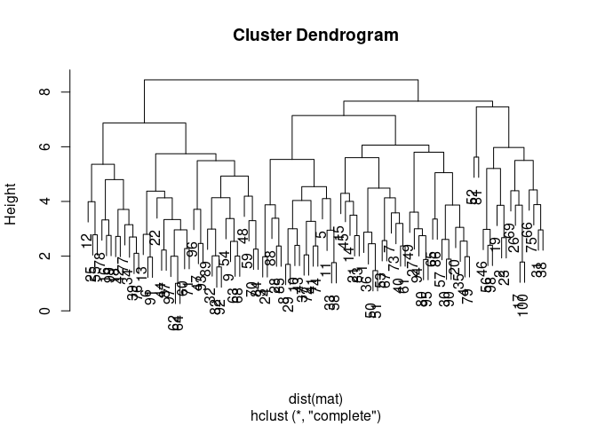

Rtools
================
Michael Jahn,
2021-11-22

<!-- badges start -->

[](https://github.com/m-jahn/R-tools/actions)
[](https://github.com/m-jahn)


<!-- badges end -->

------------------------------------------------------------------------

Utility functions for bioinformatics work

## Description

This package contains utility functions or wrappers for bioinformatics
work. It is not intended to be a full grown R package but is maintained
as a package for the sake of accessability and documentation. Feel free
to copy, fork or source functions that you find useful.

## Installation

To install the package directly from github, use this function from
`devtools` package in your R session:

``` r
require(devtools)
devtools::install_github("https://github.com/m-jahn/R-tools")
```

## Proteomics functions

### aggregate\_pep

Aggregate peptide abundances to protein abundances.

Similar to the openMS module ProteinQuantifier, this function provides
different methods to aggregate peptide intensities to their parent
proteins. It is mainly intended for the use with (raw) Diffacto results,
a table of peptide intensities and covariation scores (weights) that can
be used to filter peptides before aggregating them up to protein
abundances.

``` r
# load additional dependencies
library(Rtools)
library(dplyr)
library(tidyr)

# generate data frame
df <- data.frame(
  protein = c("A", "B", "C", "C/D", "C/D/E", "E", "F", "G"),
  n_protein = c(1,1,1,2,3,1,1,1),
  weight = rep(1,8),
  peptide = letters[1:8],
  ab1 = sample(1:100, 8),
  ab2 = sample(1:100, 8),
  ab3 = sample(1:100, 8)
)

aggregate_pep(
  data = df, 
  sample_cols = c("ab1", "ab2", "ab3"),
  protein_col = "protein",
  peptide_col = "peptide",
  n_protein_col = "n_protein",
  split_ambiguous = TRUE,
  split_char = "/",
  method = "sum"
)
```

    ## # A tibble: 7 × 5
    ##   protein n_peptides   ab1   ab2   ab3
    ##   <chr>        <int> <dbl> <dbl> <dbl>
    ## 1 A                1  64    20      75
    ## 2 B                1  19    85      24
    ## 3 C                3 153.   42.7   100
    ## 4 D                2  57.3  16.7    46
    ## 5 E                2  36.3 106.    124
    ## 6 F                1  70    79      29
    ## 7 G                1  54    11      28

### apply\_norm

Apply normalization based on different published methods. This function
is a wrapper applying different normalization functions from other
packages, such as `limma`, `justvsm` and `preprocesscore`. These are not
imported automatically but have to be installed separately.

``` r
df <- data.frame(
  protein = LETTERS[1:5],
  cond1 = sample(1:100, 5),
  cond2 = sample(1:100, 5),
  cond3 = sample(1:100, 5)
)

# normalize protein abundance to obtain identical 
# median expression of each column (condition)
# For this function we need to load one extra package
library(limma)

df_norm <- apply_norm(
  df, 
  norm_function = "normalizeMedianValues", 
  sample_cols = 2:ncol(df),
  ref_cols = NULL
)

# the data after normalization
print(df_norm)
```

    ##   protein    cond1    cond2     cond3
    ## 1       A 82.31873 21.19717 31.463266
    ## 2       B 33.14131 90.31836 80.180582
    ## 3       C 89.80225 85.71028  8.119553
    ## 4       D 72.69706 56.21857 85.255302
    ## 5       E 80.18058 80.18058 84.240358

``` r
# Has the normalization worked? We can compare column medians
# for original and normalized data
apply(df[2:4], 2, median)
```

    ## cond1 cond2 cond3 
    ##    75    87    79

``` r
apply(df_norm[2:4], 2, median)
```

    ##    cond1    cond2    cond3 
    ## 80.18058 80.18058 80.18058

### get\_topgo

Convenience wrapper to TopGO package (Rahnenfueher et al.). This
function carries out a TopGO gene ontology enrichment on a data set with
custom protein/gene IDs and GO terms. The function takes as main input a
data frame with three specific columns: cluster numbers, Gene IDs, and
GO terms. Alternatively, these can also be supplied as three individual
lists.

``` r
# The get_topgo function will require the TopGO package
# as an additional dependency that is not automatically
# attached with this package.
library(topGO)

# a list of arbitrary GO terms
go_terms <- c(
  "GO:0006412", "GO:0015979", "GO:0046148", "GO:1901566", "GO:0042777", "GO:0006614",
  "GO:0016114", "GO:0006605", "GO:0090407", "GO:0031564", "GO:0032784", "GO:0052889",
  "GO:0032787", "GO:0043953", "GO:0046394", "GO:0042168", "GO:0009124", "GO:0006090",
  "GO:0016108", "GO:0016109", "GO:0016116", "GO:0016117", "GO:0065002", "GO:0006779",
  "GO:0072330", "GO:0046390", "GO:0006754", "GO:0018298", "GO:0006782", "GO:0022618",
  "GO:0042255", "GO:0046501", "GO:0070925", "GO:0071826", "GO:0006783", "GO:0009156"
)

# construct a sample data set with 26  different genes in 2 different groups
# and test which (randomly sampled) GO terms might be enriched in both groups.
# We randomly sample 1 to 3 GO terms per gene. They need to be formatted as one
# string of GO terms separated by "; ".
df <- data.frame(
  GeneID = LETTERS,
  cluster = rep(c(1, 2), each = 13),
  Gene.ontology.IDs = sapply(1:26,
    function(x) paste(sample(go_terms, sample(1:3, 1)), collapse = ";")
  ),
  stringsAsFactors = FALSE
)

# test if GO terms are enriched in group 1 against background
get_topgo(df, selected.cluster = 1, topNodes = 5)
```

    ##        GO.ID                                        Term Annotated Significant
    ## 1 GO:0006778 porphyrin-containing compound metabolic ...         6           5
    ## 2 GO:0033013              tetrapyrrole metabolic process         6           5
    ## 3 GO:0042440                   pigment metabolic process         6           5
    ## 4 GO:0046148                pigment biosynthetic process         6           5
    ## 5 GO:0006807         nitrogen compound metabolic process        18          11
    ##   Expected classicFisher weightedFisher elimFisher              SigGenes
    ## 1        3          0.08           1.00       0.08             B,C,E,F,H
    ## 2        3          0.08           1.00       0.08             B,C,E,F,H
    ## 3        3          0.08           1.00       0.08             A,B,C,F,H
    ## 4        3          0.08           0.08       0.08             A,B,C,F,H
    ## 5        9          0.10           1.00       0.10 B,C,D,E,F,H,I,J,K,L,M

### silhouette\_analysis

Wrapper function to perform silhouette analysis on different cluster
numbers. Silhouette analysis shows the clusters that have explanatory
power. That includes clusters that are best separated from the
neighbours resulting in a higher average silhoutte width (the decisive
metric to judge optimal cluster number). This function applies the
silhouette analysis iteratively for a vector of different cluster
numbers and stores results in a list.

``` r
# generate a random matrix that we use for clustering with the 
# format of 100 rows (e.g. determined gene expression) and 10 
# columns (conditions)
mat <- matrix(rnorm(1000), ncol = 10)

# we can perform clustering on this matrix using e.g. hclust:
# there is clearly no good separation between different clusters of 'genes'
clust <- hclust(dist(mat))
plot(clust)
```

<!-- -->

``` r
# perform silhouette analysis for 2 to 10 different clusters
sil_result <- silhouette_analysis(mat, n_clusters = 2:10)

# plot results
print(sil_result$plot_clusters, split = c(1,1,2,1), more = TRUE)
print(sil_result$plot_summary, split = c(2,1,2,1))
```

<!-- -->

### parse\_kegg\_brite

Parse Kegg Brite xml files step-by-step. This script is a small utility
to parse Kegg Brite XML files and return a regular data frame instead.
The function take no other argument than a data frame. Changes that need
to be made to the Kegg XML file before applying the function,
e.g. simply using a text editor:

-   replace double spaces ’ ’ by tabs ’
-   remove first lines until regular content begins
-   possibly add some trailing tabs or commas to end of first line (4
    to 5) so that read.table knows how many columns to expect
-   read raw data frame into R using read.table(“/path/to/file”, fill =
    TRUE, sep = “, row.names = NULL, stringsAsFactors = FALSE, quote
    =”")

## Growth models

### baranyi\_fun

Simulate growth according to the Baranyi growth model.

``` r
# simulate growth according to the Baranyi growth model
# for a growth period of 100 hours
biomass <- baranyi_fun(
  LOG10N0 = -1, LOG10Nmax = 1,
  mumax = 0.1, lag = 10, t = 0:100)

# plot time versus biomass
plot(0:100, biomass)
```

<!-- -->

### gompertzm\_fun

Simulate growth according to the Gompertz modified growth model.

``` r
# simulate growth according to the Baranyi growth model
# for a growth period of 100 hours
biomass <- gompertzm_fun(
  LOG10N0 = -1, LOG10Nmax = 1,
  mumax = 0.1, lag = 10, t = 0:100)

# plot time versus biomass
plot(0:100, biomass)
```

<!-- -->
