Rtools
================
Michael Jahn,
2020-04-22

-----

Utility and wrapper functions for bioinformatics work

## Description

This package contains utility and wrapper functions that I often use. It
is not intended to be a full grown R package but is maintained as a
package for the sake of accessability and documentation. Feel free to
copy, fork or source functions that you find useful.

## Installation

To install the package directly from github, use this function from
`devtools` package in your R session:

``` r
require(devtools)
devtools::install_github("https://github.com/m-jahn/R-tools")
```

## R lattice functions

These functions extend or simplify the `panel.function` landscape for
`lattice`, a general purpose plotting package from Deepayan Sarkar.
Lattice’s functionality is comparable to the popular `ggplot` universe
but has a slightly different look and feel.

### panel.barplot

Draw barplot with error bars in lattice plots. Supports also grouping.

``` r
library(Rtools)
library(lattice)
data(mtcars)

# mean and stdev error bars are drawn for
# common x values
xyplot(mpg ~ factor(cyl), mtcars, lwd = 2, 
  panel = function(x, y, ...) {
    panel.barplot(x, y, ...)
  }
)
```

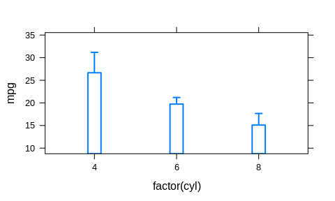<!-- -->

``` r
# using the same variable for x and grouping will
# result in typical lattice behavior
xyplot(mpg ~ factor(cyl), mtcars, 
  groups = cyl, lwd = 2,
  panel = function(x, y, ...) {
    panel.barplot(x, y, ...)
  }
)
```

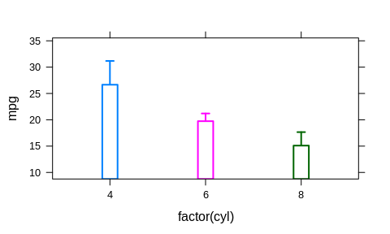<!-- -->

``` r
# we can also use different variables for the x var, grouping,
# and paneling. As a visual control that error bars are drawn
# for the correct groups we overlay the single data points.
xyplot(mpg ~ factor(cyl) | factor(vs), mtcars,
  groups = gear, lwd = 2, auto.key = list(columns = 3),
  panel = function(x, y, ...) {
    panel.barplot(x, y, beside = TRUE, ...)
    panel.stripplot(x, y, jitter.data = TRUE,
      horizontal = FALSE, amount = 0.15, ...)
  }
)
```

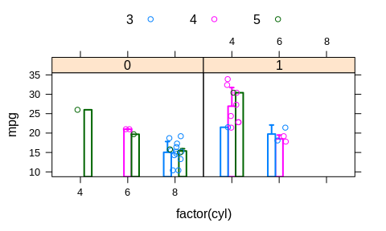<!-- -->

### panel.beeswarm

Panel function for beeswarm plots. This function builds heavily on the
`beeswarm` package.

``` r
# simple example
df <- data.frame(
  Y = sample(1:10, 60, replace = TRUE), 
  X = factor(rep(1:3, each = 20))
)

xyplot(Y ~ X, df, groups = X, panel = panel.beeswarm)
```

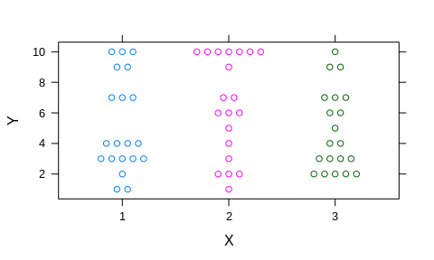<!-- -->

``` r
# but with continuous Y variable, it doesn't work as expected
df$Y <- rnorm(60)
xyplot(Y ~ X, df, groups = X, panel = panel.beeswarm)
```

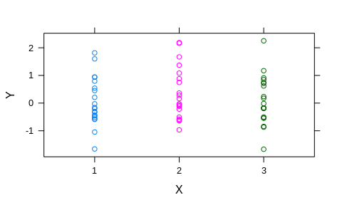<!-- -->

``` r
# for this purpose we can bin the Y variable into groups
xyplot(Y ~ X, df, groups = X, 
  panel = function(x, y, ...) {
    panel.xyplot(x, y, col = grey(0.6), ...)
    panel.beeswarm(x, y, bin_y = TRUE, breaks_y = 10, ...)
})
```

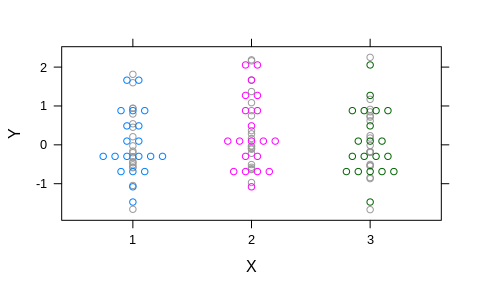<!-- -->

### panel.directlabel

Point labels for scatterplots. This function depends on the directlabels
package, but instead of labeling only groups, it labels single points.

``` r
library(grid)
library(lattice)
library(directlabels)

data("mtcars")
mtcars$car <- rownames(mtcars)

# A standard example using lattice grouping and paneling;
# We can also draw boxes around labels and change label size
xyplot(mpg ~ wt | factor(cyl), mtcars,
  groups = cyl, pch = 19, labels = mtcars$car,
  as.table = TRUE, layout = c(3, 1), cex = 0.6,
  panel = function(x, y, ...) {
    panel.xyplot(x, y, ...)
    panel.directlabel(x, y, draw_box = TRUE, box_line = TRUE, ...)
  }
)
```

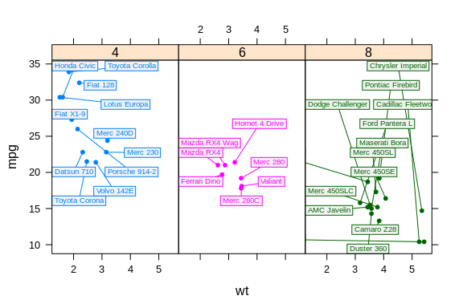<!-- -->

``` r
# A similar plot but without grouping. This requires explicit
# use of subscripts
xyplot(mpg ~ wt | factor(cyl), mtcars,
  pch = 19, labels = mtcars$car,
  as.table = TRUE, layout = c(3, 1),
  panel = function(x, y, subscripts, ...) {
    panel.xyplot(x, y, ...)
    panel.directlabel(x, y, subscripts = subscripts, 
      draw_box = TRUE, box_fill = "white", ...)
  }
)
```

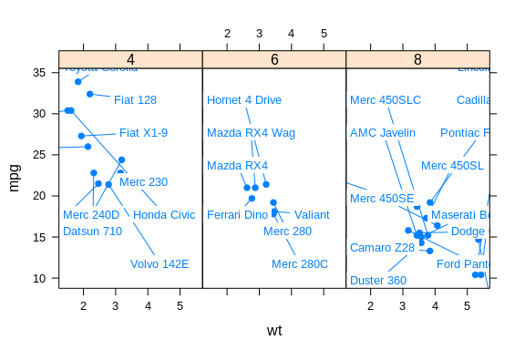<!-- -->

``` r
# An example without panels and more groups
xyplot(mpg ~ wt, mtcars,
  groups = hp, pch = 19, 
  labels = mtcars$wt, cex = 0.6,
  panel = function(x, y, ...) {
    panel.xyplot(x, y, ...)
    panel.directlabel(x, y, draw_box = TRUE, box_line = TRUE, ...)
  }
)
```

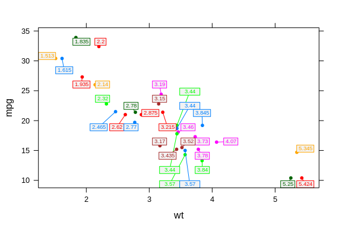<!-- -->

### panel.errbars

Draw error bars in lattice plots. This functions is very similar to
`panel.barplot` only with points instead of bars.

``` r
library(lattice)
data(mtcars)

# mean and stdev error bars are drawn for
# common x values
xyplot(mpg ~ factor(cyl), mtcars, 
  lwd = 2, pch = 19, cex = 1.5,
  panel = function(x, y, ...) {
    panel.errbars(x, y, ...)
  }
)
```

<!-- -->

``` r
# using the same variable for x and grouping will
# result in typical lattice behavior
xyplot(mpg ~ factor(cyl), mtcars,
  groups = cyl, lwd = 2, pch = 19, cex = 1.5,
  panel = function(x, y, ...) {
    panel.errbars(x, y, ...)
  }
)
```

<!-- -->

``` r
# we can also use different variables for the x var, grouping,
# and paneling. As a visual control that error bars are drawn 
# for the correct groups we overlay the single data points. 
xyplot(mpg ~ factor(cyl) | factor(vs), mtcars,
  groups = gear, lwd = 2, pch = 19, cex = 1.5,
  auto.key = list(columns = 3),
  panel = function(x, y, ...) {
    panel.stripplot(x, y, jitter.data = TRUE, 
      horizontal = FALSE, amount = 0.15, alpha = 0.3, ...)
    panel.errbars(x, y, beside = TRUE, ...)
  }
)
```

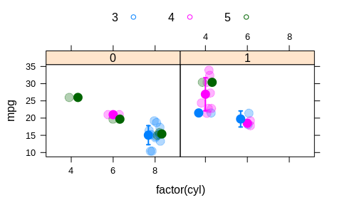<!-- -->

### panel.key

Draw custom keys in lattice plots. Allows to draw a key (legend) inside
a lattice panel, with more customization options than the lattice
default.

``` r
library(lattice)
data(mtcars)

# Two examples for a custom lattice key
# inside a panel. The first with taking all arguments from the 
# top-level plotting function, the second with custom arguments.
xyplot(mpg ~ 1/wt | factor(vs), mtcars,
  groups = carb, pch = 19, cex = 1,
  panel = function(x, y, ...) {
    panel.xyplot(x, y, ...)
    panel.key(...)
    panel.key(labels = letters[1:5], which.panel = 2, 
      corner = c(0.9, 0.1), col = 1:5, pch = 3, cex = 1)
  }
)
```

<!-- -->

### panel.piechart

Draw pie and ring charts in lattice plots. This custom panel function
for lattice plots allows to draw pie charts (or rings) while still being
able to use the typical lattice way of subsetting data. The function can
be used within xyplot() but only one variable needs to be supplied (x).
Grouping is supported in which the x variable is aggregated (summed up)
over each unique group.

``` r
library(grid)
library(lattice)

data("USMortality")

# A simple example using lattice paneling
xyplot( ~ Rate | Sex, USMortality,
  main = "US mortality rates by sex",
  scales = list(draw = FALSE),
  panel = function(x, ...) {
    panel.piechart(x, ...)
  }
)
```

<!-- -->

``` r
# A more advanced example using grouping and
# adjusting graphical parameters. The main variable 
# 'x' is now summed up for each value of 'groups'
xyplot( ~ Rate | Sex, USMortality,
  groups = gsub(" ", "\n", Cause), 
  col = heat.colors(10),
  border = grey(0.3), cex = 0.7,
  main = "US mortality rates by sex",
  scales = list(draw = FALSE),
  panel = function(x, ...) {
    panel.piechart(x, diameter_sector = 0.1, ...)
  }
)
```

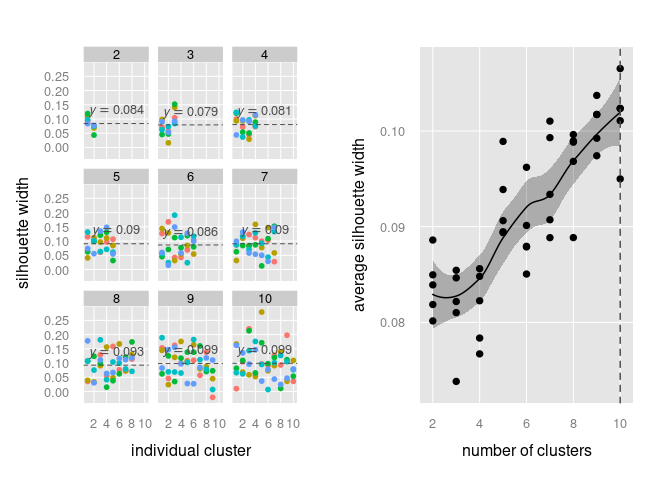<!-- -->

### panel.pvalue

Calculate and draw p-values in lattice plots.

``` r
library(lattice)
data(mtcars)

# p-values are calculated between groups of x, grouping variable is ignored
xyplot(mpg ~ factor(cyl), mtcars, groups = cyl, pch = 19, cex = 0.7,
  panel = function(x, y, ...) {
    panel.stripplot(x, y, jitter.data = TRUE, 
      horizontal = FALSE, amount = 0.15, ...)
    panel.pvalue(x, y, std = 1, symbol = TRUE, pvalue = TRUE)
})
```

<!-- -->

### panel.quadrants

Draw quadrants and quadrant statistics in lattice plots. This custom
panel function for lattice plots allows to draw custom quadrants and
display additional quadrant statistics as often used in biomedial
sciences. Groups are ignored.

``` r
library(lattice)
data(mtcars)

# Default behavior for quadrants is to split x and y data
# at the respective median, and plot percentage of points 
# per quandrant
xyplot(mpg ~ 1/wt | factor(vs), mtcars,
  groups = carb, pch = 19, cex = 1,
  panel = function(x, y, ...) {
    panel.xyplot(x, y, ...)
    panel.quadrants(x, y, ...)
  }
)
```

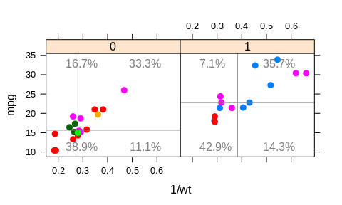<!-- -->

### custom.ggplot

Custom theme for lattice plots. The function takes no arguments.

``` r
library(lattice)
data(mtcars)

# colors are more subtle than default lattice theme
xyplot(mpg ~ factor(cyl) | gear, mtcars,
  groups = cyl, auto.key = list(columns = 3),
  par.settings = custom.ggplot()
)
```

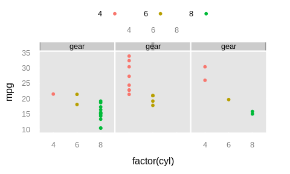<!-- -->

### custom.lattice

Custom theme for lattice plots. The function takes no arguments.

``` r
library(lattice)
data(mtcars)

# colors are more subtle than default lattice theme
xyplot(mpg ~ factor(cyl) | gear, mtcars,
  groups = cyl, auto.key = list(columns = 3),
  par.settings = custom.lattice()
)
```

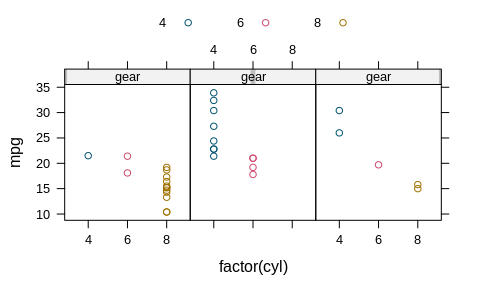<!-- -->

### custom\_splom

Custom scatterplot matrix (SPLOM)

``` r
library(lattice)
data(mtcars)

# Draw a scatterplot matrix of all variables of a 
# data frame against each other.
custom_splom(mtcars[1:5])
```

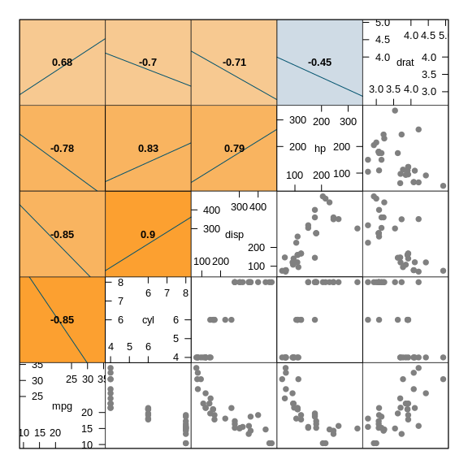<!-- -->

``` r
# We can customize the scatterplot
custom_splom(
  mtcars[1:5],
  col_palette = rainbow(4),
  scales = 10, 
  xlab = "data points", ylab = "regression",
  pch = 1, col = 1, cex = 0.6
)
```

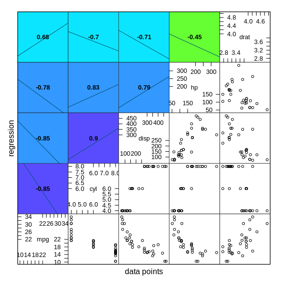<!-- -->

## Molecular biology related functions

### aggregate\_pep

Aggregate peptide abundances to protein abundances.

Similar to the openMS module ProteinQuantifier, this function provides
different methods to aggregate peptide intensities to their parent
proteins. It is mainly intended for the use with (raw) Diffacto results,
a table of peptide intensities and covariation scores (weights) that can
be used to filter peptides before aggregating them up to protein
abundances.

``` r
# load additional dependencies
library(dplyr)
library(tidyr)

# generate data frame
df <- data.frame(
  protein = c("A", "B", "C", "C/D", "C/D/E", "E", "F", "G"),
  n_protein = c(1,1,1,2,3,1,1,1),
  weight = rep(1,8),
  peptide = letters[1:8],
  ab1 = sample(1:100, 8),
  ab2 = sample(1:100, 8),
  ab3 = sample(1:100, 8)
)

aggregate_pep(
  data = df, 
  sample_cols = c("ab1", "ab2", "ab3"),
  protein_col = "protein",
  peptide_col = "peptide",
  n_protein_col = "n_protein",
  split_ambiguous = TRUE,
  split_char = "/",
  method = "sum"
)
```

    ## # A tibble: 7 x 5
    ##   protein n_peptides   ab1   ab2   ab3
    ##   <chr>        <int> <dbl> <dbl> <dbl>
    ## 1 A                1   9    78    90  
    ## 2 B                1  17    38    80  
    ## 3 C                3  78.7  67.2  75.2
    ## 4 D                2  17.7  21.2  34.2
    ## 5 E                2  27.7  50.7  67.7
    ## 6 F                1  32    66    22  
    ## 7 G                1  81     5     6

### apply\_norm

Apply normalization based on different published methods. This function
is a wrapper applying different normalization functions from other
packages, such as `limma`, `justvsm` and `preprocesscore`.

``` r
df <- data.frame(
  protein = LETTERS[1:5],
  cond1 = sample(1:100, 5),
  cond2 = sample(1:100, 5),
  cond3 = sample(1:100, 5)
)

# normalize protein abundance to obtain identical 
# median expression of each column (condition)
# For this function we need to load one extra package
library(limma)

df_norm <- apply_norm(
  df, 
  norm_function = "normalizeMedianValues", 
  sample_cols = 2:ncol(df),
  ref_cols = NULL
)

# the data after normalization
print(df_norm)
```

    ##   protein    cond1    cond2     cond3
    ## 1       A 79.82247 71.79799   4.62739
    ## 2       B 53.21498 52.37030  60.15607
    ## 3       C 51.16825 70.10863 115.68474
    ## 4       D 16.37384 25.34047  53.21498
    ## 5       E 96.19631 53.21498  20.82325

``` r
# Has the normalization worked? We can compare column medians
# for original and normalized data
apply(df[2:4], 2, median)
```

    ## cond1 cond2 cond3 
    ##    52    63    46

``` r
apply(df_norm[2:4], 2, median)
```

    ##    cond1    cond2    cond3 
    ## 53.21498 53.21498 53.21498

### GetTopGO

Convenience wrapper to TopGO package (Rahnenfueher et al.). This
function carries out a TopGO gene ontology enrichment on a data set with
custom protein/gene IDs and GO terms. The function takes as main input a
data frame with three specific columns: cluster numbers, Gene IDs, and
GO terms. Alternatively, these can also be supplied as three individual
lists.

``` r
# The get_topgo function will require the TopGO package
# as an additional dependency that is not automatically
# attached with this package.
library(topGO)

# a list of arbitrary GO terms
go_terms <- c(
  "GO:0006412", "GO:0015979", "GO:0046148", "GO:1901566", "GO:0042777", "GO:0006614",
  "GO:0016114", "GO:0006605", "GO:0090407", "GO:0031564", "GO:0032784", "GO:0052889",
  "GO:0032787", "GO:0043953", "GO:0046394", "GO:0042168", "GO:0009124", "GO:0006090",
  "GO:0016108", "GO:0016109", "GO:0016116", "GO:0016117", "GO:0065002", "GO:0006779",
  "GO:0072330", "GO:0046390", "GO:0006754", "GO:0018298", "GO:0006782", "GO:0022618",
  "GO:0042255", "GO:0046501", "GO:0070925", "GO:0071826", "GO:0006783", "GO:0009156"
)

# construct a sample data set with 26  different genes in 2 different groups
# and test which (randomly sampled) GO terms might be enriched in both groups.
# We randomly sample 1 to 3 GO terms per gene. They need to be formatted as one
# string of GO terms separated by "; ".
df <- data.frame(
  GeneID = LETTERS,
  cluster = rep(c(1, 2), each = 13),
  Gene.ontology.IDs = sapply(1:26,
    function(x) paste(sample(go_terms, sample(1:3, 1)), collapse = ";")
  ),
  stringsAsFactors = FALSE
)

# test if GO terms are enriched in group 1 against background
get_topgo(df, selected.cluster = 1, topNodes = 5)
```

    ##        GO.ID                                  Term Annotated Significant
    ## 1 GO:0006886       intracellular protein transport         4           4
    ## 2 GO:0034613         cellular protein localization         4           4
    ## 3 GO:0046907               intracellular transport         4           4
    ## 4 GO:0051641                 cellular localization         4           4
    ## 5 GO:0051649 establishment of localization in cell         4           4
    ##   Expected classicFisher weightedFisher elimFisher SigGenes
    ## 1        2         0.048          0.096      0.048  C,E,F,L
    ## 2        2         0.048          1.000      0.048  C,E,F,L
    ## 3        2         0.048          1.000      0.048  C,E,F,L
    ## 4        2         0.048          1.000      0.048  C,E,F,L
    ## 5        2         0.048          1.000      0.048  C,E,F,L

### silhouette\_analysis

Wrapper function to perform silhouette analysis on different cluster
numbers. Silhouette analysis shows the clusters that have explanatory
power. That includes clusters that are best separated from the
neighbours resulting in a higher average silhoutte width (the decisive
metric to judge optimal cluster number). This function applies the
silhouette analysis iteratively for a vector of different cluster
numbers and stores results in a list.

``` r
# this function requires some additional packlages
library(lattice)
library(latticeExtra)
library(cluster)
library(dplyr)

# generate a random matrix that we use for clustering with the 
# format of 100 rows (e.g. determined gene expression) and 10 
# columns (conditions)
mat <- matrix(rnorm(1000), ncol = 10)

# we can perform clustering on this matrix using e.g. hclust:
# there is clearly no good separation between different clusters of 'genes'
clust <- hclust(dist(mat))
plot(clust)
```

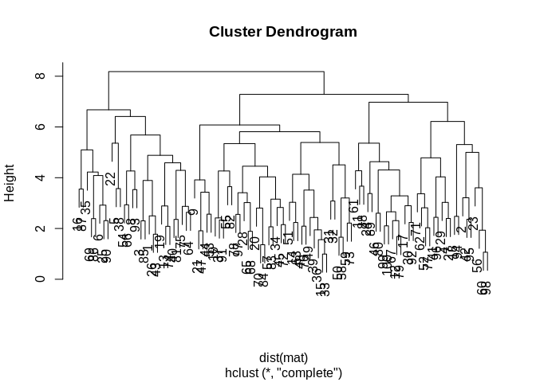<!-- -->

``` r
# perform silhouette analysis for 2 to 10 different clusters
sil_result <- silhouette_analysis(mat, n_clusters = 2:10)
```

    ## Silhouette analysis finished for clusters 2 to 10

``` r
# plot results
print(sil_result$plot.clusters, split = c(1,1,2,1), more = TRUE)
print(sil_result$plot.summary, split = c(2,1,2,1))
```

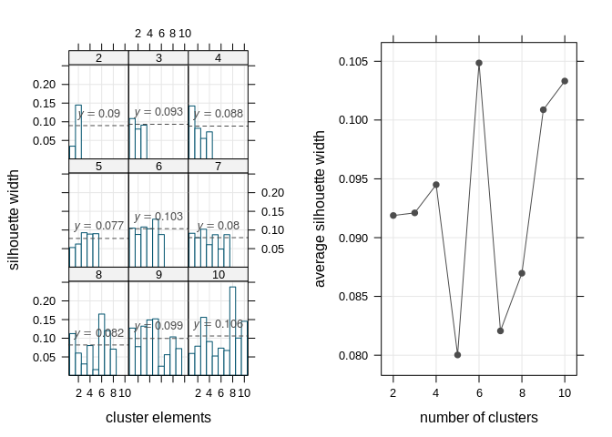<!-- -->

### parse\_kegg\_brite

Parse Kegg Brite xml files step-by-step. This script is a small utility
to parse Kegg Brite XML files and return a regular data frame instead.
The function take no other argument than a data frame. Changes that need
to be made to the Kegg XML file before applying the function,
e.g. simply using a text editor:

  - replace double spaces ’ ’ by tabs ’
  - remove first lines until regular content begins
  - possibly add some trailing tabs or commas to end of first line (4 to
    5) so that read.table knows how many columns to expect
  - read raw data frame into R using read.table(“/path/to/file”, fill =
    TRUE, sep = “, row.names = NULL, stringsAsFactors = FALSE, quote
    =”")

### baranyi\_fun

Simulate growth according to the Baranyi growth model.

``` r
# simulate growth according to the Baranyi growth model
# for a growth period of 100 hours
biomass <- baranyi_fun(
  LOG10N0 = -1, LOG10Nmax = 1,
  mumax = 0.1, lag = 10, t = 0:100)

# plot time versus biomass
plot(0:100, biomass)
```

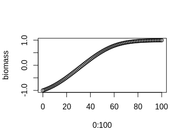<!-- -->

### gompertzm\_fun

Simulate growth according to the Gompertz modified growth model.

``` r
# simulate growth according to the Baranyi growth model
# for a growth period of 100 hours
biomass <- gompertzm_fun(
  LOG10N0 = -1, LOG10Nmax = 1,
  mumax = 0.1, lag = 10, t = 0:100)

# plot time versus biomass
plot(0:100, biomass)
```

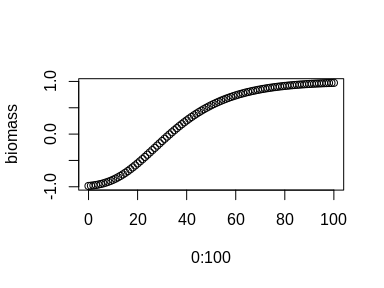<!-- -->
